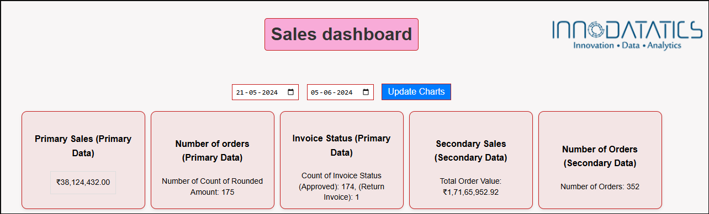
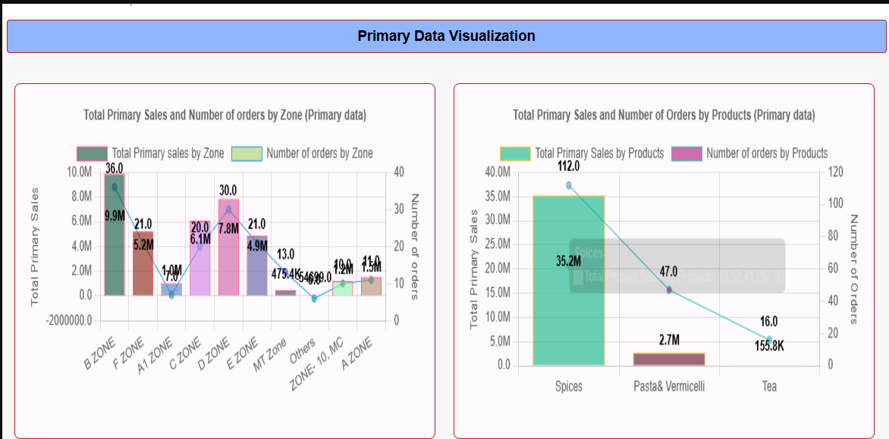
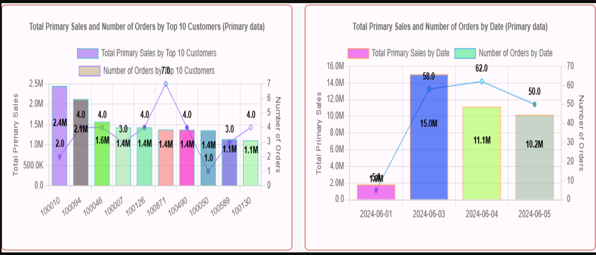
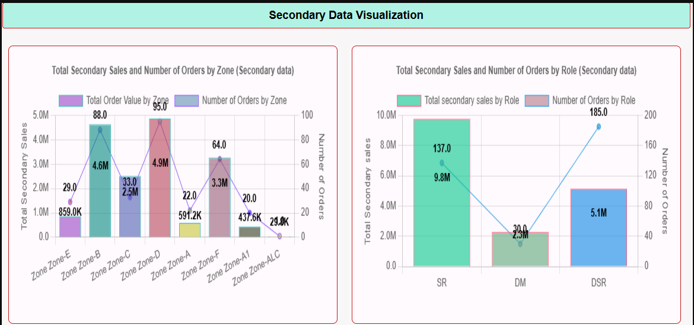

# VISUALISED-AND-INTERACTIVE-SALES-DASHBOARD-USING-HTML-CSS-AND-JAVASCRIPT

## Sales Analytics Dashboard using HTML, CSS, JavaScript, MySQL, and Node.js

## About the Project

This Sales Analytics Dashboard was developed during my Data Analyst Internship at Innodatatics to analyze primary and secondary sales data through interactive visualizations and KPI monitoring. The dashboard enables real-time sales performance tracking, trend analysis, and business insights using data stored in a MySQL database.

## Tools Used

HTML, CSS, JavaScript, MySQL, Node.js, Visual Studio Code, Chart.js, REST APIs

   
## Project Description

1. Developed a fully interactive Sales Analytics Dashboard using HTML, CSS, JavaScript, MySQL, and Node.js.
2. Integrated MySQL database with the frontend application to fetch and visualize real-time sales data dynamically.
3. Designed responsive dashboard layouts with KPI cards, charts, and filters to provide a comprehensive view of sales performance.
4. Implemented date range filtering functionality to enable users to analyze sales trends across different periods.
5. Created multiple visualizations including bar charts, line charts, pie charts, and customer-wise sales analysis dashboards.
6. Automated data retrieval and dashboard updates based on user-selected date ranges and filters.
7. Built dynamic KPI cards to monitor key sales metrics such as Total Invoices, Total Sites, Total Party Groups, and Total Sales Amount.
8. Developed interactive and responsive charts with automatically displayed data labels to improve business reporting and analysis.
9. Analyzed primary and secondary sales data to identify sales patterns, customer contributions, invoice trends, and site performance.
10. Delivered a centralized reporting solution that simplified sales monitoring and supported data-driven business decisions.

## Analysis Performed

1. Invoice trend analysis by date.
2. Invoice type analysis across Tax Invoice, Return Invoice, and Bill of Supply categories.
3. Customer-wise sales performance analysis.
4. Site-wise sales contribution analysis.
5. Party Group performance analysis.
6. Primary and secondary sales comparison analysis.
7. Sales amount trend analysis across different periods.
8. Top customer contribution analysis.
9. Invoice status analysis.
10. Shipment and sales order tracking analysis.
11. Date-wise sales performance monitoring.
12. Business performance analysis using interactive KPI dashboards.

## KPIs & Measures

1. Total Invoices
2. Total Sites
3. Total Party Groups
4. Total Customers
5. Total Rounded Amount
6. Sales Amount by Date
7. Sales Amount by Site
8. Sales Amount by Party Group
9. Top Customers by Sales Amount
10. Invoice Type Distribution
11. Invoice Status Distribution
12. Primary Sales Metrics
13. Secondary Sales Metrics

## Key Insights

1. Identified top-performing customers contributing the highest sales revenue.
2. Analyzed sales distribution across multiple sites to determine high-performing business locations.
3. Tracked invoice trends over time to understand sales growth and seasonal variations.
4. Evaluated the contribution of different invoice types to overall business performance.
5. Highlighted high-value party groups driving significant portions of sales revenue.
6. Monitored sales performance through dynamic KPI cards for quick business assessment.
7. Enabled faster identification of sales trends and performance fluctuations through interactive visualizations.
8. Improved visibility into customer, site, and invoice-level performance using centralized reporting.
9. Reduced manual reporting efforts by automating sales analysis and dashboard updates.
10. Supported data-driven decision-making through real-time sales monitoring and trend analysis.

## Skills Demonstrated

1. Sales Analytics
2. Data Visualization
3. Front-End Development
4. Dashboard Development
5. Database Management
6. SQL Querying
7. Data Retrieval and Integration
8. JavaScript Programming
9. REST API Integration
10. Responsive Web Design
11. KPI Development
12. Business Intelligence Reporting
13. Trend Analysis
14. Customer Analytics
15. Performance Monitoring
16. Data Storytelling
17. Problem Solving
18. Reporting Automation
19. Interactive Dashboard Design
20. Full-Stack Analytics Development

## Dashboard Screenshots

<h3>Dashboard Overview</h3>

<h3>Primary Data Sales Analysis-1</h3>

<h3>Primary Data Sales Analysis-2</h3>

<h3>Secondary Data Sales Analysis-1</h3>

